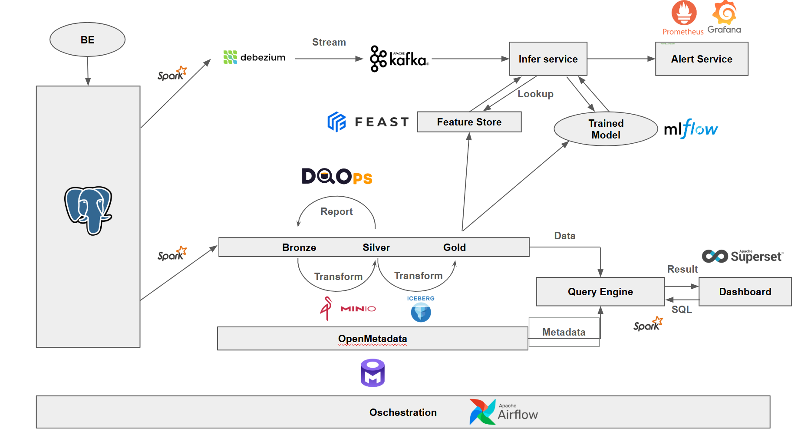

# Design and Implementation of a Real-Time Lakehouse Data Pipeline Integrating Data Quality Operations and Anomaly Detection for Fraud Detection

This project implements a modern data lakehouse architecture using Docker for containerization. It demonstrates a full data lifecycle, from ingestion and processing to data quality monitoring and business intelligence.

## Architecture

The architecture is designed to be scalable, modular, and robust, leveraging open-source technologies.

The system architecture consists of the following key components:

*   **Infrastructure (Docker):** All services are containerized using Docker and orchestrated with Docker Compose, ensuring reproducibility, portability, and simplified deployment across environments (local, staging, production).
*   **Orchestration and Monitoring (Apache Airflow):** Apache Airflow is responsible for orchestrating and scheduling all data workflows — including data ingestion, transformation (ETL), feature computation, model retraining, and data quality checks.
It also manages dependencies between batch and streaming tasks, ensuring reliability and observability across the data lifecycle.
*   **Data Storage from client (Postgre):** Data from the client source is stored in PostgreSQL to decouple the ingestion layer from downstream processes and to provide reliable data backup.
* **Ingestion (Apache Spark):** Spark is an effective computing engines that provides Strutured Streaming and Batch Ingestion as well as processing data in Lakehouse.
*   **Object Storage (MinIO & Apache Iceberg):** MinIO provides an S3-compatible object storage solution. Apache Iceberg is used as the table format on top of MinIO, enabling ACID transactions, time travel, and schema evolution.Data is organized in a Medallion Architecture:
    *   **Bronze:** Raw, unprocessed data ingested from source systems.
    *   **Silver:** Cleaned, validated, and enriched data.
    *   **Gold:** Aggregated, feature-ready data for analytics and model serving.
*   **Metadata Management (OpenMetadata):** OpenMetadata acts as the central metadata catalog. It stores dataset schemas, lineage, ownership, and operational metadata, enabling unified governance across Spark, DQOps, and BI tools.
*   **Data Quality (DQOps):** DQOps is integrated to ensure data quality across the lakehouse. It connects to the Spark Thrift Server to retrieve schemas and run data quality checks using SQL.
*   **Query Engine (Spark Thrift Server):** The Spark Thrift Server provides a JDBC/ODBC interface to the data stored in the lakehouse, allowing BI tools to query the data using standard SQL.
*   **Analytics & BI (Apache Superset):** Superset is a modern data exploration and visualization platform. It connects to the Spark Thrift Server to query the gold layer data and build interactive dashboards.
*   **CDC (Debezium):** Debezium continuously monitors PostgreSQL’s transaction logs to detect real-time changes (insert/update/delete). It streams these events to Apache Kafka, enabling real-time data ingestion into the lakehouse and instant fraud detection scenarios.
*   **Messesge queue (Apache Kafka):** Apache Kafka serves as the event streaming backbone. It decouples producers (Debezium, backend systems) from consumers (Spark streaming, Infer Service, Feature Store).
*   **Feature Store (Feast):** Feast acts as a centralized feature store for machine learning applications.It stores and serves computed features from the Gold layer, ensuring feature consistency between training and real-time inference. Feast allows the Infer Service to retrieve the latest user or transaction features directly during prediction.
*   **Model Lifecycle Management (MLFlow):** MLflow manages the entire machine learning lifecycle:
    *   **Experiment tracking (metrics, parameters, artifacts)**
    *   **Model versioning and registry**
    *   **Deployment of trained models to the Infer Service**: Models trained offline (batch) using Spark are logged to MLflow and then deployed for real-time inference.
*   **Monitoring & Alerting (Prometheus + Grafana):**
    * Prometheus collects metrics from system components (Kafka, Spark, Airflow, Infer Service).
    * Grafana visualizes these metrics in real-time dashboards and triggers alerts based on thresholds (e.g., data ingestion lag, inference latency, or error rate).

## Data Flow

1.  **Ingestion:** Data is ingested from various sources into the Bronze layer in MinIO. This process is orchestrated by an Airflow DAG.
2.  **ETL Processing:** Airflow triggers Spark jobs to perform transformations:
    *   **Bronze to Silver:** Raw data is cleaned, deduplicated, and transformed.
    *   **Silver to Gold:** Silver data is aggregated and modeled to create business-level tables.
3.  **Data Quality:** DQOps continuously monitors the data in the lakehouse. It runs predefined checks and rules to detect anomalies, schema changes, and other data quality issues.
4.  **Analytics:** Business users and data analysts can explore the curated data in the Gold layer using Apache Superset, creating reports and dashboards to derive insights.

## Technology Stack

*   **Orchestration:** Apache Airflow
*   **Containerization:** Docker, Docker Compose
*   **Object Storage:** MinIO
*   **Data Lakehouse Format:** Delta Lake
*   **Compute Engine:** Apache Spark
*   **Metadata Store:** Hive Metastore
*   **Data Quality:** DQOps
*   **BI & Analytics:** Apache Superset

Reference
1. https://github.com/qdinh18/Data_Quality_in_Lakehouse/tree/main?tab=readme-ov-file
2. https://github.com/dqops/dqo
3. Learn spark: 
3.1. https://medium.com/@MarinAgli1/setting-up-a-spark-standalone-cluster-on-docker-in-layman-terms-8cbdc9fdd14b
3.2. https://medium.com/@suffyan.asad1/spark-parallelization-of-reading-data-from-jdbc-sources-e8b35e94cb82 
3.3. https://medium.com/@dkalouris/setting-up-and-connecting-airflow-and-spark-using-docker-compose-9773dec21bc8
4. Airflow: https://medium.com/@dkalouris/setting-up-and-connecting-airflow-and-spark-using-docker-compose-9773dec21bc8
5. Learn architecture: https://medium.com/@simardeep.oberoi/building-a-data-streaming-pipeline-leveraging-kafka-spark-airflow-and-docker-16527f9e9142